# Computational Photography

A collection of projects exploring core computational photography techniques -- from regression and filtering to panoramic stitching, HDR imaging, denoising, and lensless image reconstruction via ADMM.

**Built with:** Python, NumPy, OpenCV, Matplotlib, SciPy, scikit-learn, BM3D

---

## 1. Least Squares Regression

Fit 12th-order polynomials to noisy datasets using three regression methods and analyzed the overfitting/regularization tradeoff.

<p align="center">
  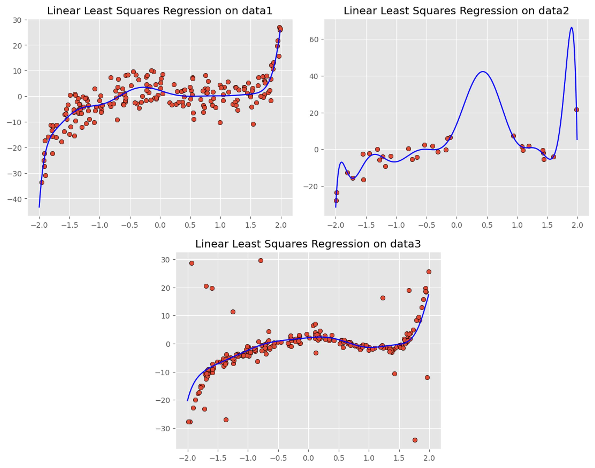
</p>
<p align="center"><i>Linear least squares: good fits on datasets 1 & 3, but severe overfitting on dataset 2 (wild oscillations from fitting to noise)</i></p>

Ridge regression with L2 regularization corrected the overfitting -- higher lambda values eliminated the noise-driven bumps. Huber regression provided the best overall robustness to outliers without manual lambda tuning:

<p align="center">
  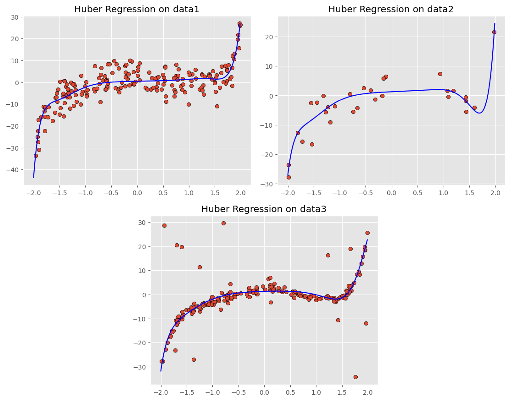
</p>
<p align="center"><i>Huber regression: stable polynomial fits across all three datasets, resistant to outliers</i></p>

> Full analysis: [`Least Squares/report.pdf`](Least%20Squares/report.pdf)

---

## 2. Gaussian Blurs & Convolution

Implemented image convolution from scratch in both the spatial and Fourier domains, then explored frequency-domain image manipulation.

### Edge Detection with Sobel Filters

Applied 9 different filters including Gaussian blurs, sharpening kernels, and Sobel edge detectors to the Iribe Center building:

<p align="center">
  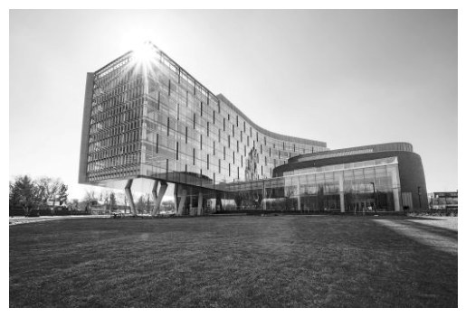
  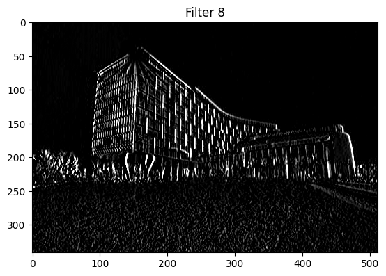
</p>
<p align="center"><i>Left: Original grayscale image of the Iribe Center. Right: Sobel edge detection revealing structural boundaries</i></p>

### Magnitude/Phase Swapping

Combined the **magnitude spectrum of a hippo** with the **phase spectrum of a zebra** -- demonstrating that phase carries most of the structural information in an image:

<p align="center">
  
  
  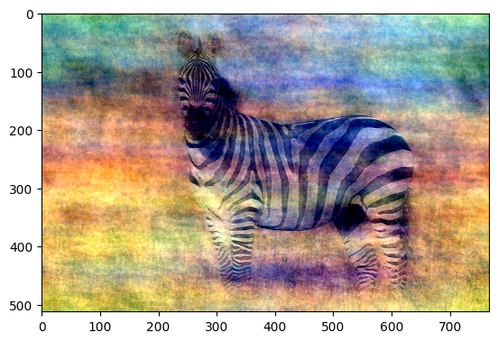
</p>
<p align="center"><i>Hippo (magnitude donor) + Zebra (phase donor) = result that looks like a zebra, proving phase dominates perception</i></p>

### Hybrid Images

Replaced the lowest 39x39 frequencies of the zebra with those of the hippo, creating an image that looks like a **hippo up close** and a **zebra from far away**:

<p align="center">
  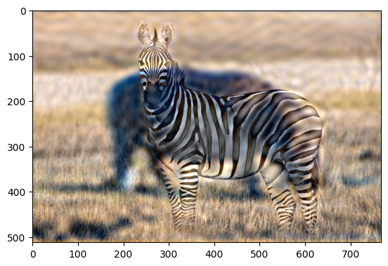
</p>
<p align="center"><i>Hybrid image: zoom in to see the hippo's low-frequency structure, zoom out to see the zebra's high-frequency details</i></p>

---

## 3. Panoramic Stitching

Built an automatic panorama pipeline that stitches three overlapping photos into a single wide-angle image.

### Pipeline

**SIFT features** were extracted from each image, then **brute-force matched** across image pairs. **RANSAC** robustly estimated the 3x3 homography matrices, and the images were warped into a common coordinate frame:

<p align="center">
  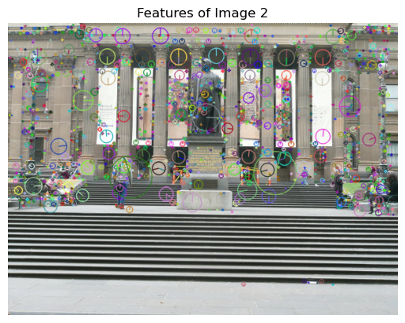
</p>
<p align="center"><i>SIFT keypoints detected on the center image -- scale and orientation encoded in each circle</i></p>

<p align="center">
  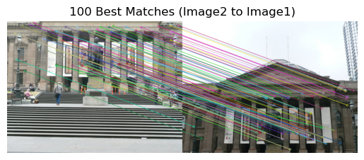
</p>
<p align="center"><i>100 best feature matches between image pairs, used to estimate the homography</i></p>

### Result

<p align="center">
  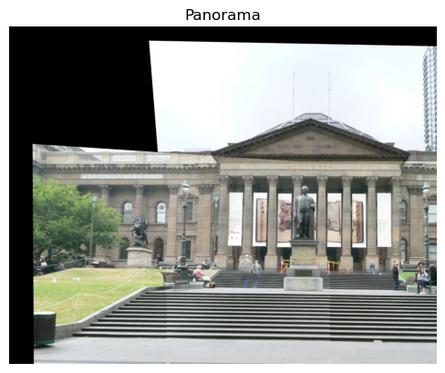
</p>
<p align="center"><i>Final panorama: three perspective images stitched into a seamless wide-angle view</i></p>

> Full analysis: [`Panoramic Stiching/wlin123_Project1.pdf`](Panoramic%20Stiching/wlin123_Project1.pdf)

---

## 4. HDR Imaging

Combined 16 LDR exposures of a scene into a single HDR image, then tone-mapped and gamma-corrected it for display.

The pipeline processes raw `.nef` camera files, merges exposures using four different weighting functions (uniform, tent, Gaussian, photon), applies Reinhard-style tone mapping, and finishes with sRGB gamma correction:

<p align="center">
  
  
</p>
<p align="center">
  
  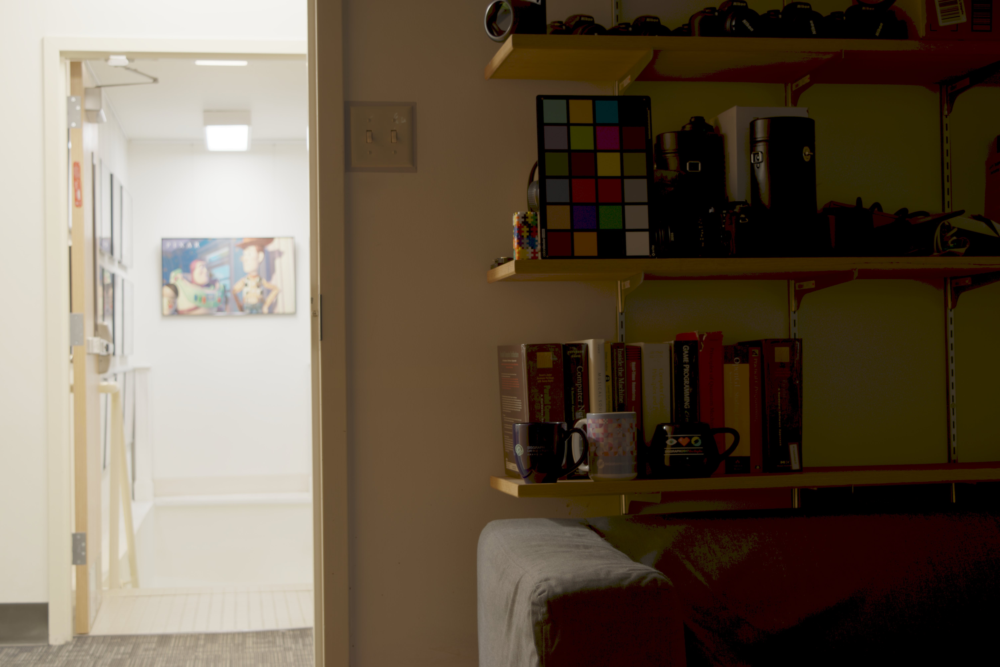
</p>
<p align="center"><i>Final gamma-corrected HDR results using four weighting functions: Uniform (top-left), Tent (top-right), Gaussian (bottom-left), Photon (bottom-right). All capture detail in both the bright hallway and dark shelving that no single exposure could.</i></p>

Tone mapping parameters K (brightness) and B (white point) were swept across a 5x5 grid to find optimal settings (K=0.02, B=3). JPEG compression analysis showed quality 40 as the lowest setting with no visible artifacts, achieving a ~28.5x compression ratio.

> Full analysis with tone mapping grid and compression results: [`HDR/report.pdf`](HDR/report.pdf)

---

## 5. Image Denoising

Compared four denoising algorithms on a grayscale image corrupted with Gaussian noise (sigma=20), measuring quality with PSNR.

<p align="center">
  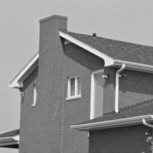
  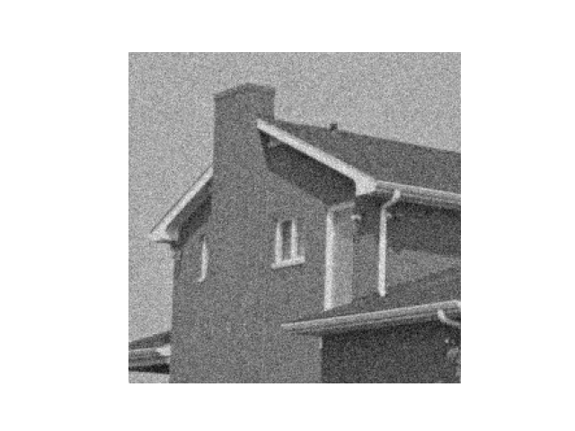
  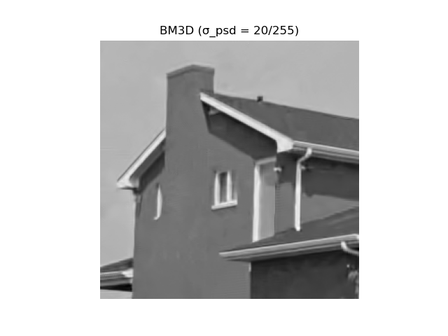
</p>
<p align="center"><i>Left: Original. Center: Noisy (PSNR 22.10 dB). Right: BM3D denoised (PSNR 33.62 dB) -- noise removed while preserving edges</i></p>

| Algorithm | Best PSNR | Key Observation |
|-----------|-----------|----------------|
| **Gaussian Filter** | 29.64 dB | Removes noise but heavily blurs the image |
| **Bilateral Filter** | 29.67 dB | Edge-aware: preserves sharp boundaries while smoothing flat regions |
| **Non-Local Means** | 33.12 dB | Exploits self-similarity across the image; loses some fine texture |
| **BM3D** | **33.62 dB** | State-of-the-art; groups similar 3D blocks for collaborative filtering |

BM3D achieved the highest PSNR but lost some fine brick texture. The bilateral filter offered the best balance of noise removal and edge preservation among the hand-implemented methods.

> Full comparison grids across all parameter sweeps: [`Denoising/report.pdf`](Denoising/report.pdf)

---

## 6. Lensless Image Reconstruction (ADMM)

Reconstructed images from raw lensless camera sensor data using the **Alternating Direction Method of Multipliers (ADMM)**.

Starting from raw sensor data that looks like an unrecognizable blur, the ADMM pipeline reconstructed a clear image of a hand using multiple regularization strategies:

<p align="center">
  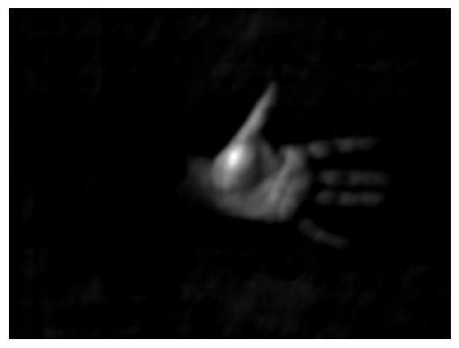
  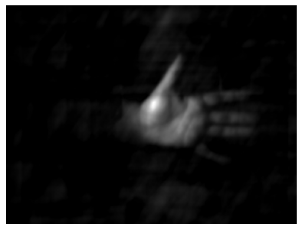
  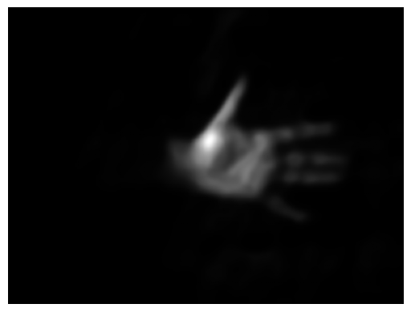
</p>
<p align="center"><i>Left: ADMM with Total Variation (sharpest edges). Center: ADMM with L1 regularization. Right: Plug-and-Play ADMM with BM3D denoiser via Conjugate Gradient solver</i></p>

The difference map below highlights where L1 regularization diverges from the TV baseline (red regions indicate extra light leakage):

<p align="center">
  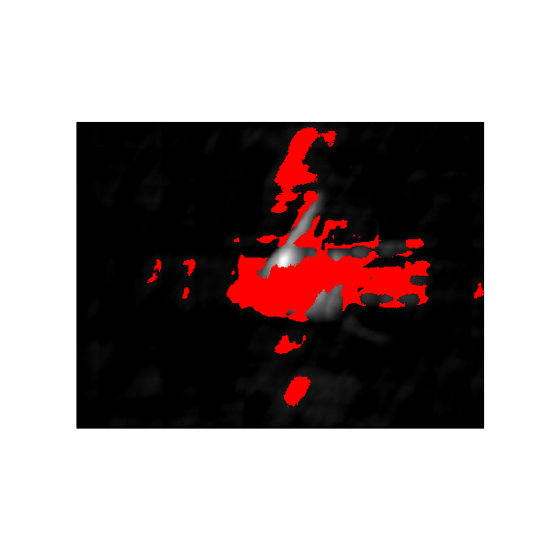
</p>
<p align="center"><i>Red regions show where L1 reconstruction differs from TV -- L1 lets through more light artifacts around the hand</i></p>

### Methods Implemented
- **Total Variation (TV) regularization** -- L1 norm on image gradients; best edge preservation
- **L1 regularization** -- soft-thresholding that emphasizes stronger signals
- **L2 regularization** -- quadratic smoothing; proportionally reduces all values
- **Plug-and-Play ADMM with BM3D** -- replaces the proximal operator with a learned denoiser, solved via both closed-form FFT and Conjugate Gradient updates

> Full mathematical derivations and results: [`ADMM/report.pdf`](ADMM/report.pdf)

---

## Repository Structure

```
.
├── Least Squares/          # Polynomial regression: OLS, Ridge, Huber
├── Gaussian Blurs and Convolution/  # Spatial & FFT convolution, hybrid images
├── Panoramic Stiching/     # SIFT + RANSAC panorama pipeline
├── HDR/                    # Multi-exposure HDR merge, tone mapping, gamma
├── Denoising/              # Gaussian, Bilateral, NLM, BM3D comparison
├── ADMM/                   # Lensless reconstruction: TV, L1, L2, PnP-BM3D
└── images/                 # Result images used in this README
```

Each project folder contains the Python source code and a detailed PDF report with all results and analysis.
